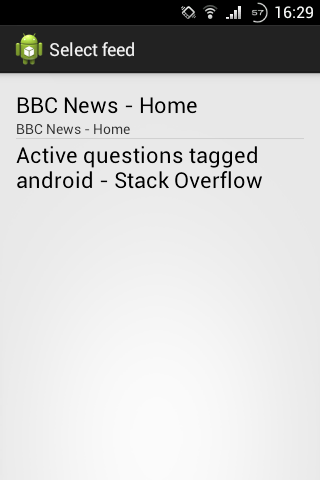

# Описание

Приложение представляет собой RSS-ридер. Оно включает в себя следующие компоненты:
- UI для отображения списка каналов с возможностью их добавления/удаления (**AlertDialog**)
- UI для отображения списка статей (**ListView** + **BaseAdapter**)
- UI для отображения контента статьи (**WebView**)
- Загрузка и парсинг данных из сети в **IntentService** (**URLConnection**, **SAX** и **AsyncTask**)
- Хранение всех данных в БД **SQLite** (**ContentProvider**)
- Загрузка данных из БД с помощью **AsyncTaskLoader**

Приложение предназначено для Android 4.4 (API 20) и будет работать на смартфонах с версией не ниже
Android 4.0.3 (API 15).

### Скриншоты

